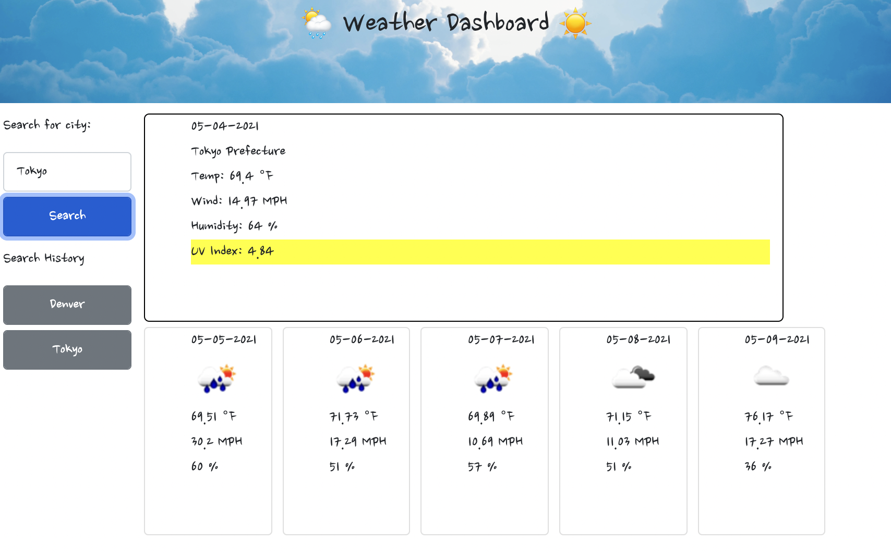

# weatherDashboard-HW6

A dashboard allowing users to search different cities and view the current and 5 day forecast for that city.

- When the user searches for a city, the current weather conditions and 5 day forecast are presented.
- UV Index is highlighted with color animation to indicate severity.
- With each search, a button appears under search history. The user may press it to recall that city's weather data.
- When the user reloads the page, the previously searched city buttons remain, but will clear with next reload so buttons don't persist FOREVER

# Technologies

- `HTML`
- `CSS`
- `JAVASCRIPT`
- `Bootstrap`
- `Openweather API`
